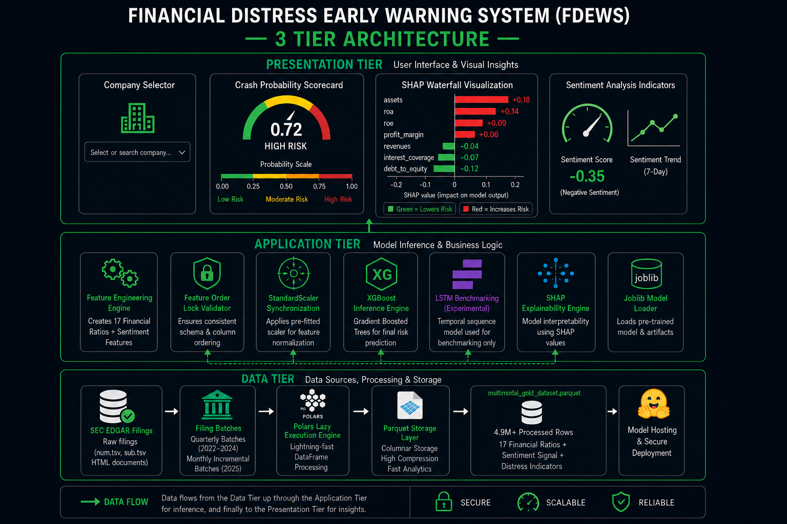
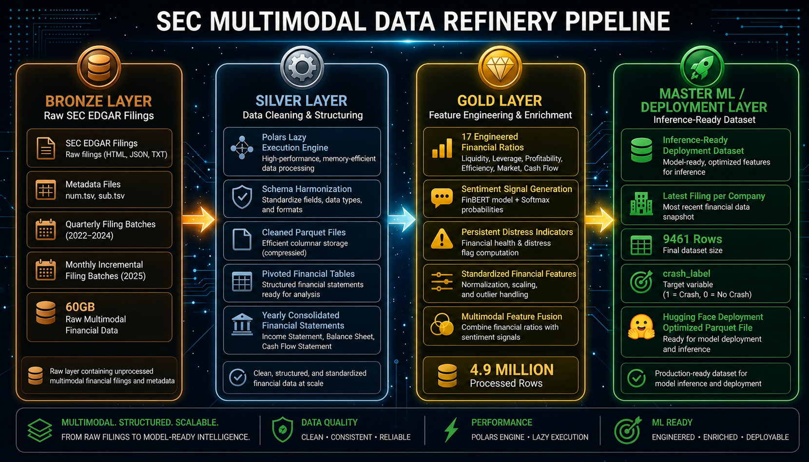
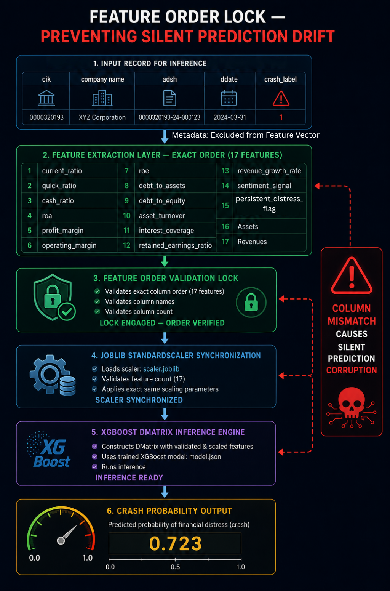
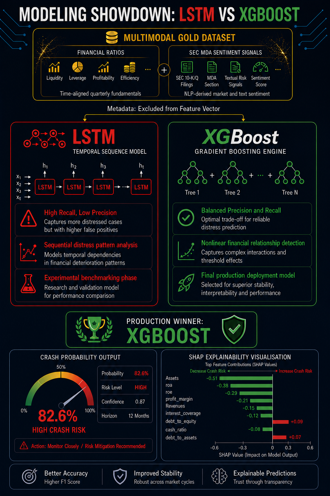
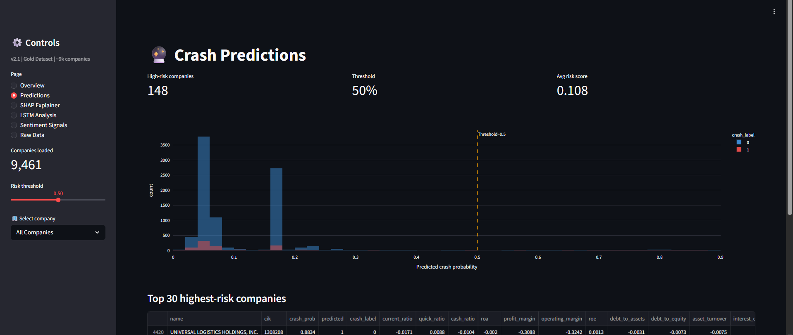

# Financial Distress Early Warning System (FDEWS)

> **End-to-end ML pipeline for corporate insolvency prediction using 60GB+ of SEC EDGAR filings.**  
> Medallion Architecture (Bronze → Silver → Gold) | Multimodal: Financial Ratios + NLP Sentiment | XGBoost + SHAP Explainability

[](https://huggingface.co/spaces/Jenababu/sec-risk-dashboard)
[]()
[]()
[]()

---

## Overview

FDEWS handles out-of-core processing for 60GB+ of SEC 10-K/10-Q filings using Polars Lazy Evaluation, which keeps the RAM footprint low regardless of dataset size. It maps 17 engineered financial ratios to FinBERT-derived MD&A textual sentiment to predict corporate financial distress 12 months ahead. XGBoost runs inference with full SHAP explainability, returning a crash probability and ranked feature attribution for every company.

**Production winner: XGBoost** won because it offers a tunable precision/recall threshold. This is critical in credit risk where a false positive wastes capital and a false negative destroys it.

---

## System Architecture

### 3-Tier Application Design



The system is organized into three tiers:

- **Presentation Tier** : Company selector, Crash Probability Scorecard (gauge), SHAP Waterfall visualization, Sentiment Analysis indicators.
- **Application Tier** : Feature Engineering Engine (17 features), Feature Order Lock Validator, StandardScaler Synchronization, XGBoost Inference Engine, SHAP Explainability Engine, Joblib Model Loader. LSTM is present as an experimental benchmarking component only.
- **Data Tier** : SEC EDGAR raw filings → Quarterly/Monthly batches → Polars Lazy Execution → Parquet Storage → 4.9M-row Gold dataset → Model hosting.

---

## SEC Multimodal Data Refinery Pipeline



The pipeline follows the **Medallion Architecture**:

| Layer | What Happens | Key Output |
|---|---|---|
| **Bronze** | Raw SEC EDGAR ingestion (HTML, JSON, TSV) — 60GB, quarterly + monthly batches | `num.tsv`, `sub.tsv`, HTML filings |
| **Silver** | Polars Lazy Engine, schema harmonization, float32 downcasting, Parquet storage, pivoted financial tables | Clean columnar Parquet files |
| **Gold** | 17 engineered financial ratios, FinBERT sentiment signal, persistent distress flags, multimodal feature fusion | `multimodal_gold_dataset.parquet` — 4.9M rows |
| **Master/Deployment** | Latest filing per company, inference-ready subset, HuggingFace Parquet upload | 9,461 rows, `crash_label` target |

**Sentiment Signal Formula:**

```
Sentiment = Probability_Positive − Probability_Negative
```

Range: `-1.0` (extreme distress) → `+1.0` (extreme confidence). Derived from FinBERT Softmax output on MD&A sections.

---

## Feature Order Lock — Silent Prediction Drift Prevention



Column mismatch between training and inference causes **silent prediction corruption**. The model will continue to run without error, but it scores the wrong features. The Feature Order Lock enforces:

1. **Exact column order** : 17 features locked at extraction time.
2. **Column name validation** : names must match training schema exactly.
3. **Feature count check** : any deviation raises a hard error before the scaler is applied.
5. **Scaler synchronization** : `scaler.joblib` applies identical `mean_` and `scale_` parameters from training.
6. **DMatrix construction** : validated, scaled features passed to `model.json` for inference.

> **Null handling:** If a company misses a filing quarter, affected ratio features are forward-filled from the most recent available filing before the feature vector is constructed. A missing filing doesn't mean the pipeline crashes. Instead, it's built to degrade gracefully to the last known state. We use a two-quarter window for the persistent_distress_flag so the model can account for these gaps automatically.

**The 17 locked features (in order):**

| # | Feature | # | Feature | # | Feature |
|---|---|---|---|---|---|
| 1 | current_ratio | 7 | roe | 13 | revenue_growth_rate |
| 2 | quick_ratio | 8 | debt_to_assets | 14 | sentiment_signal |
| 3 | cash_ratio | 9 | debt_to_equity | 15 | persistent_distress_flag |
| 4 | roa | 10 | asset_turnover | 16 | Assets |
| 5 | profit_margin | 11 | interest_coverage | 17 | Revenues |
| 6 | operating_margin | 12 | retained_earnings_ratio | | |

Metadata (`cik`, `company_name`, `adsh`, `ddate`, `crash_label`) is excluded from the feature vector.

---

## Modeling Showdown: LSTM vs XGBoost



| Dimension | LSTM | XGBoost |
|---|---|---|
| **Type** | Temporal sequence model | Gradient boosting ensemble |
| **Strength** | Sequential distress pattern analysis | Nonlinear financial relationship detection |
| **Weakness** | High recall, low precision — false alarm machine | — |
| **Status** | Experimental benchmarking only | **Production model** |
| **Why LSTM failed** | Likely overfitting on temporal noise; flags nearly all healthy companies as distressed. In credit risk, a false positive wastes capital. A false negative destroys it. LSTM's low precision makes the cost of false positives unacceptable. | — |
| **Why XGBoost won** | Offers a tunable decision threshold to control the precision/recall trade-off explicitly. Captures nonlinear interactions (e.g., high `debt_to_equity` is tolerable unless `sentiment_signal` is negative). Superior stability across market cycles. | ✅ |

**XGBoost Production Output Example:**
- Crash Probability: **82.6%** | Risk Level: HIGH | Confidence: 0.87 | Horizon: 12 months
- Top SHAP drivers: `Assets` (−0.51), `roa` (−0.38), `roe` (−0.29), `debt_to_equity` (+0.09)

---

## Live Dashboard

> **[Open Live Demo on HuggingFace Spaces](https://huggingface.co/spaces/Sk-Jena/sec-risk-dashboard)**



The dashboard runs on the Gold Dataset (9,461 companies, 8.4% crash rate, 17 features) and has 6 pages:
 
| Page | What It Shows |
|---|---|
| **Overview** | Crash label distribution (8.4% crash rate), per-feature violin plots split by crash/safe label |
| **Predictions** | Adjustable risk threshold slider, histogram of predicted crash probabilities, Top 30 highest-risk companies table with all 17 feature values |
| **SHAP Explainer** | Global feature importance bar chart (`sentiment_signal` ranks #1 by a wide margin — confirming NLP is the dominant signal, not a supplementary one), SHAP beeswarm, single-company waterfall |
| **LSTM Analysis** | Training history curves (epoch vs. accuracy/loss/recall), LSTM dataset explorer (`final_lstm_dataset.parquet`, shape 9461×23) |
| **Sentiment Signals** | MDA sentiment signal table (1,745 filings with extracted signals), distribution histogram |
| **Raw Data Explorer** | Full Gold Dataset, Sentiment, LSTM, and File Status tabs — shape 9461×23 |

---

## Technical Stack

| Layer | Technology | Role |
|---|---|---|
| Data Processing | **Polars** (Lazy/Streaming) | Out-of-core 60GB ingestion. It processes datasets larger than the available RAM by building a query plan and materializing only the required columns |
| Storage | **Parquet** | Columnar, compressed, fast analytical reads |
| NLP | **FinBERT** (HuggingFace Transformers) | MD&A sentiment extraction + Softmax signal |
| HTML Parsing | **BeautifulSoup + Regex** | MD&A section extraction from SEC HTML filings |
| ML | **XGBoost** | Primary distress prediction model |
| Temporal ML | **LSTM** (PyTorch/Keras) | Experimental benchmarking only |
| Explainability | **SHAP** | SHapley Additive Explanations, waterfall plots |
| Validation | **Walk-Forward Temporal Split** | Prevents data leakage across economic cycles |
| Serialization | **Joblib** | Scaler + model artifact persistence |
| Interface | **Streamlit / HuggingFace Spaces** | Risk monitoring dashboard |

---

## Repository Structure

```
Financial-distress-early-warning-system/
├── bronze_layer/          # SEC EDGAR scrapers, raw TSV/HTML ingestion
├── silver_layer/          # Schema enforcement, Parquet partitioning, downcasting
├── gold_layer/            # Feature engineering, FinBERT sentiment, distress flags
├── modeling/              # XGBoost training, LSTM benchmarking, SHAP analysis
├── notebooks/             # Exploratory analysis, prototyping, colab experiments
├── dashboard/             # Streamlit app, model artifacts (model.json, scaler.joblib)
├── data/                  # dataset_link.md → Google Drive access instructions
├── docs/
│   └── images/            # Architecture diagrams (place PNGs here)
│       ├── 3-TIER_SYSTEM_ARCHITECTURE.png
│       ├── DASHBOARD.png
│       ├── FEATURE_ORDER_LOCK_V2.png
│       ├── MODEL_COMPARISION_V2
│       ├── SEC_MULTIMODAL_DATA_REFINERY_PIPELINE_V2.png
│       ├── Shap Explainer.png
        └── XGBoost Forensic Report (SHAP values).png
├── model_utils.py         # Backend inference engine (shared utilities)
├── requirements.txt       # Python dependencies
├── .gitignore             # Excludes large/temporary files
└── LICENSE                # Apache-2.0
```

---

## Dataset Access

Raw (60GB) and processed data are hosted externally due to size.  
See [`data/dataset_link.md`](data/dataset_link.md) for Google Drive access instructions.

---

## Known Limitations
 
- LSTM is benchmarking-only; precision is too low for production credit decisions.
- Sentiment signal coverage is partial: 1,745 of 9,461 companies have an extracted MD&A signal. The remaining ~7,700 have `sentiment_signal = 0` (neutral default), which may understate distress in companies with parseable but unprocessed filings.
- Sentiment signal quality degrades on companies with boilerplate/templated MD&A language.
- Walk-forward split assumes stationarity of distress patterns across economic cycles, this holds for 2020–2024 but may need recalibration post-2025 rate environment.
- `persistent_distress_flag` uses a 2 quarter window; longer windows untested.
